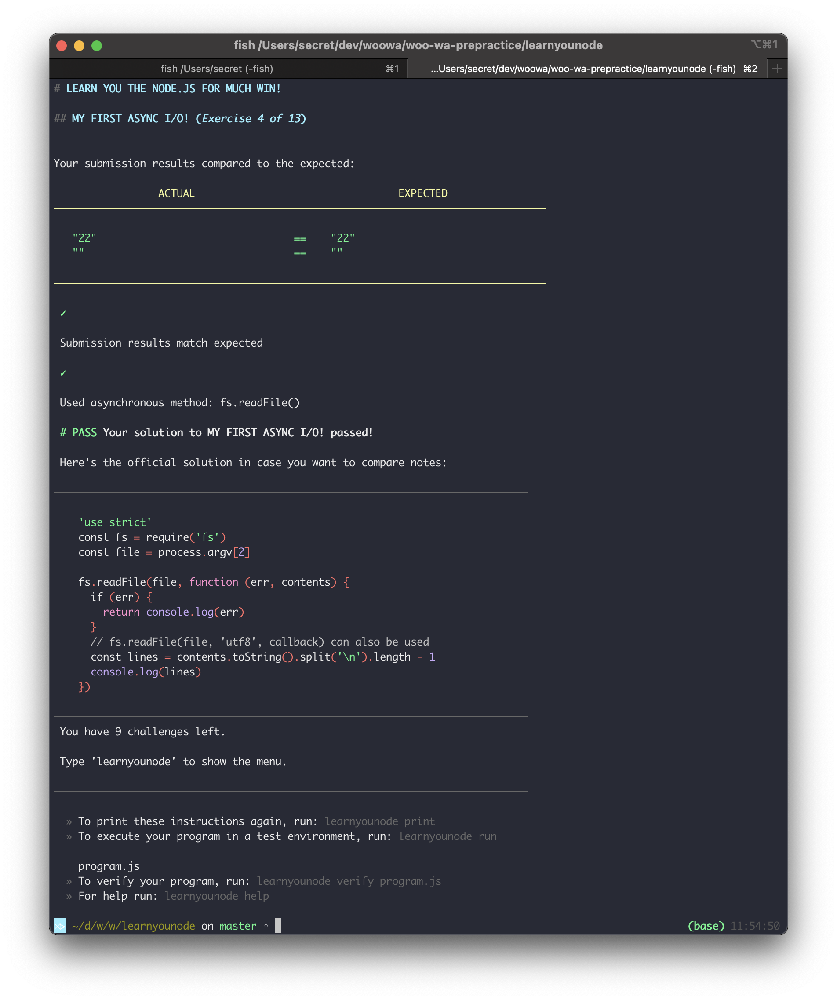

# learnyounode

## 문제 해결 스크린샷

### hello-world

### baby-step

### my-first-io 

### my-first-async-io

### filtered-ls

### make-it-modular

### http-client

### http-collect

### juggling-async

### time-server

### http-file-server

### http-uppercaserer

### http-json-api-server
